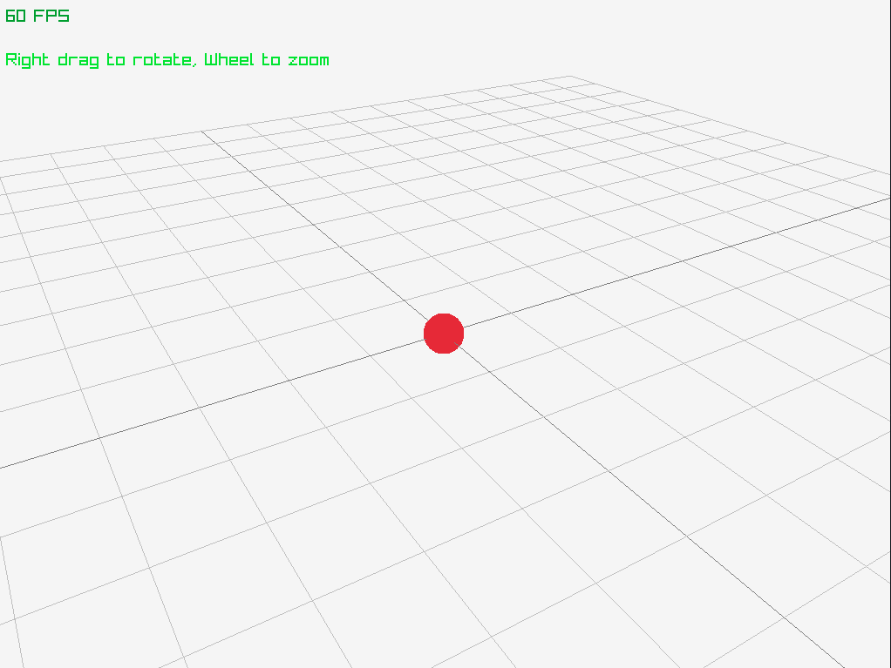

# Raygen

Raygen is a header-only library binding [raylib](https://github.com/raysan5/raylib) and Eigen3.

Aimming at rapid prototyping of interactive 3D scenes. Raygen is basically a toolset for the purpose of my Computer Graphics Study.

## Examples

**Ex1. Orbit Camera Control**

`Alt+Left Mouse Button` to drag and rotate, `Mouse Wheel` to zoom in/out.



**Ex2. Parallel For Loop Utilization**
```c++
  for (int i = 0; i < size_long; i++) {
    // unparalleled
  }

  Raygen::parallel_for(size_long, [&](const int i) {
    // paralleled
  });
```

```
[         Unparalleled Computing :        754.25ms      ]
[           Paralleled Computing :        64.973ms      ]
```

**Ex3. Mass Spring Game**


